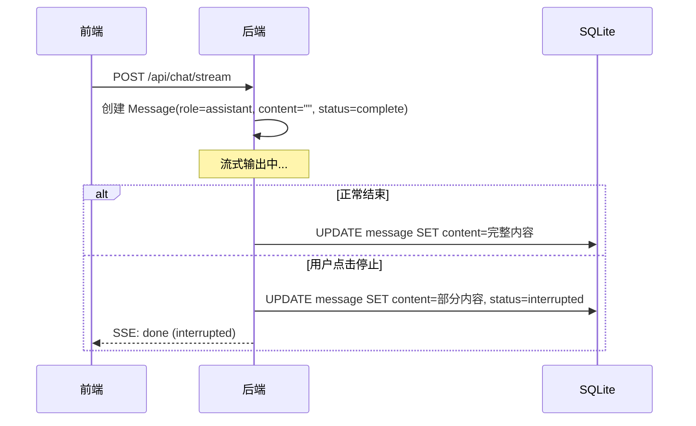

# 第二章：后端数据库层

## 目标

设计数据模型，建立 SQLite + SQLModel 的异步数据层，配置 Alembic 管理数据库迁移。

## 前置知识

如果你没接触过 Python 数据库生态，先理解这几个概念：

| 概念 | 类比前端 | 作用 |
|------|---------|------|
| SQLAlchemy | TypeORM / Prisma | Python 最主流的 ORM，底层引擎 |
| SQLModel | zod + TypeORM 合体 | FastAPI 作者出品，SQLAlchemy + Pydantic 的融合 |
| Alembic | Prisma migrate / Knex migration | 数据库迁移工具，管理表结构变更历史 |
| aiosqlite | N/A | 让 SQLite 支持 async/await |

## 为什么选 SQLModel 而不是原生 SQLAlchemy？

原生 SQLAlchemy 需要写两套类：一套 ORM 模型，一套 Pydantic schema。SQLModel 把它们合并成一个类：

```python
# SQLModel: 一个类同时是 ORM 模型和 Pydantic schema
class Conversation(SQLModel, table=True):
    id: str = Field(primary_key=True)
    title: str = Field(default="新对话")
```

`table=True` 告诉 SQLModel "这个类对应一张数据库表"。去掉 `table=True` 就是纯 Pydantic schema。

## 数据模型设计

### conversations 表

```python
class Conversation(SQLModel, table=True):
    __tablename__ = "conversations"

    id: str = Field(primary_key=True, default_factory=lambda: str(uuid4()))
    title: str = Field(default="新对话", max_length=200)
    created_at: datetime = Field(default_factory=datetime.utcnow)
    updated_at: datetime = Field(default_factory=datetime.utcnow)
```

设计决策：
- **id 用 UUID 字符串**：前端可以直接用，不存在整数自增的隐私问题
- **title 默认 "新对话"**：第一条消息发送后，后端自动更新为消息前 30 字
- **updated_at**：每次有新消息时更新，用于对话列表排序

### messages 表

```python
class Message(SQLModel, table=True):
    __tablename__ = "messages"

    id: str = Field(primary_key=True, default_factory=lambda: str(uuid4()))
    conversation_id: str = Field(foreign_key="conversations.id", index=True)
    role: str = Field(index=True)  # "user" | "assistant"
    content: str = Field(default="")
    status: str = Field(default=MessageStatus.COMPLETE)
    created_at: datetime = Field(default_factory=datetime.utcnow)
```

设计决策：
- **conversation_id 建索引**：按对话查消息是最高频查询
- **role 建索引**：未来可能只查 assistant 消息做统计
- **status 字段**：区分"正常结束"和"被打断"的消息，用于支持停止生成功能
- **content 用字符串**：Markdown 格式的消息体

时序图：消息状态流转



## 异步数据库连接

```python
# database.py
from sqlalchemy.ext.asyncio import AsyncSession, create_async_engine

DATABASE_URL = settings.database_url.replace("sqlite:///", "sqlite+aiosqlite:///")
engine = create_async_engine(DATABASE_URL)
async_session = sessionmaker(engine, class_=AsyncSession)

async def get_session():
    async with async_session() as session:
        yield session
```

关键知识点：

1. **为什么用 async？** FastAPI 是异步框架。如果用同步 ORM，数据库操作会阻塞事件循环，其他请求被卡住
2. **aiosqlite 是什么？** 原生 SQLite 不支持 async。aiosqlite 用线程池包装同步操作，提供 async 接口
3. **sessionmaker + AsyncSession**：每次请求创建一个新的数据库会话（事务单元），请求结束自动关闭

## Alembic 数据库迁移

Alembic 管理数据库表结构变更，类似前端的 Git 管理代码变更。

```bash
# 生成新迁移（检测模型变更，自动生成 SQL）
alembic revision --autogenerate -m "add new table"

# 应用迁移到数据库
alembic upgrade head

# 回滚上一次迁移
alembic downgrade -1
```

本项目预置了初始迁移 `001_initial_tables.py`，包含 conversations 和 messages 两张表的创建 SQL。

```bash
cd backend
source .venv/bin/activate
alembic upgrade head    # 执行迁移，创建数据库文件
```

## 测试策略

使用内存 SQLite 隔离每个测试：

```python
@pytest_asyncio.fixture
async def db_session():
    engine = create_async_engine("sqlite+aiosqlite:///:memory:")
    async with engine.begin() as conn:
        await conn.run_sync(SQLModel.metadata.create_all)
    # ... yield session ...
    async with engine.begin() as conn:
        await conn.run_sync(SQLModel.metadata.drop_all)
```

每个测试函数拿到全新的空数据库，测试完销毁。不存在测试间的数据污染。

运行测试：

```bash
cd backend
pytest tests/test_models.py -v
```

## 本章新增文件

```
backend/
├── database.py                 # SQLite 连接 + session 工厂
├── alembic.ini                 # Alembic 配置
├── alembic/
│   ├── env.py                  # 迁移环境配置
│   ├── script.py.mako          # 迁移脚本模板
│   └── versions/
│       └── 001_initial_tables.py  # 初始迁移
├── models/
│   ├── __init__.py
│   ├── conversation.py         # Conversation 表
│   └── message.py              # Message 表
└── tests/
    ├── __init__.py
    ├── conftest.py             # 测试 fixtures
    └── test_models.py          # 模型测试
```
