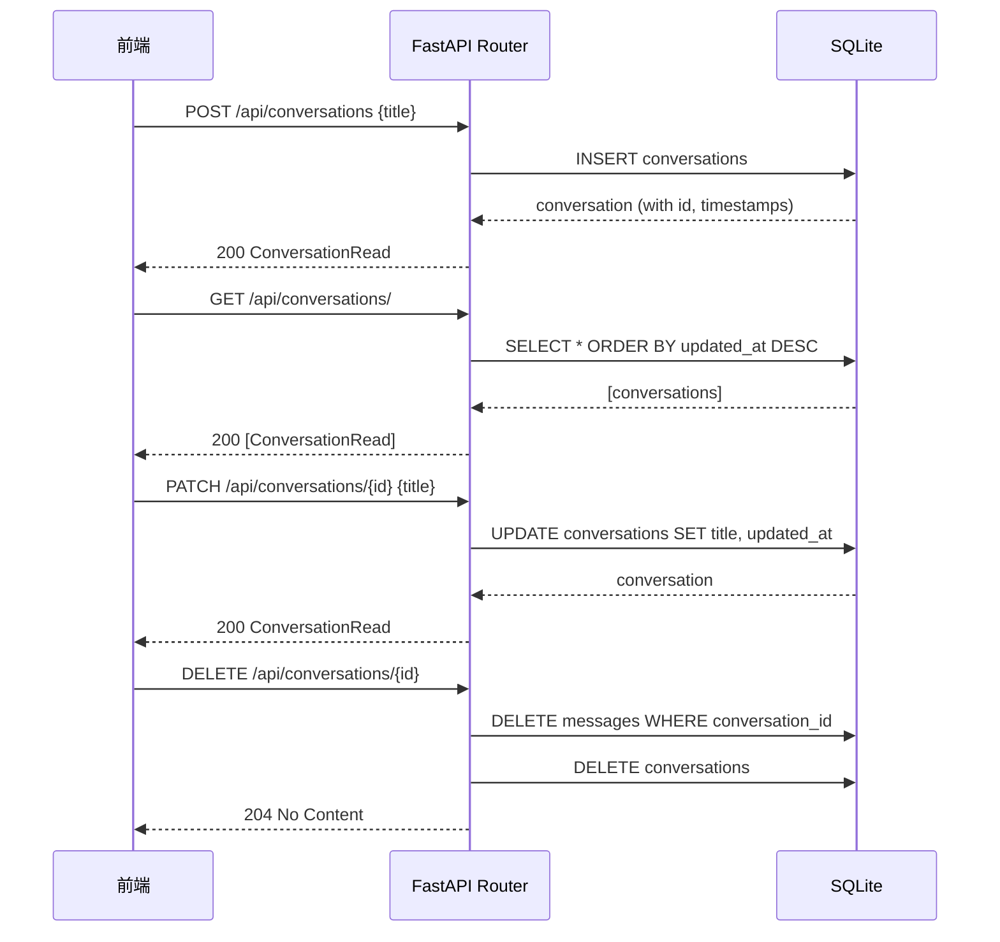

# 第三章：后端对话 CRUD API

## 目标

实现对话的增删改查 REST API，使用 Pydantic schema 分离请求/响应数据结构。

## 前置知识

### Schema vs Model

在前端你可能习惯用一个类型同时做验证和数据库操作。Python/FastAPI 的最佳实践是分两层：

| 层 | 类 | 职责 |
|---|---|------|
| **Model** | `Conversation(SQLModel, table=True)` | 数据库表映射，含外键、索引 |
| **Schema** | `ConversationCreate(BaseModel)` | API 请求体定义，只含客户端需要传的字段 |

```python
# Schema: 客户端只需要传 title
class ConversationCreate(BaseModel):
    title: str = Field(default="新对话", max_length=200)

# Model: 数据库需要 id、created_at、updated_at
class Conversation(SQLModel, table=True):
    id: str = Field(primary_key=True, default_factory=lambda: str(uuid4()))
    title: str = Field(default="新对话")
    created_at: datetime = Field(default_factory=datetime.utcnow)
    updated_at: datetime = Field(default_factory=datetime.utcnow)
```

为什么分开？
- **安全**：客户端不能传 `id` 或 `created_at`，这些由后端生成
- **灵活**：Model 有外键字段（`conversation_id`），但 Schema 不需要暴露

### FastAPI 路由

类比前端路由：

```python
# FastAPI
@router.post("/api/conversations/")
async def create_conversation(data: ConversationCreate):
    ...

# Express
router.post('/api/conversations', (req, res) => {
    const data = ConversationCreateSchema.parse(req.body)
    ...
})
```

关键区别：
- FastAPI 用类型注解自动验证请求体（不需要手动调 `.parse()`）
- `response_model` 自动过滤响应字段（Model 的敏感字段不会返回）
- `Depends(get_session)` 是依赖注入，类似 React Context

## CRUD 实现

### Create

```python
@router.post("/", response_model=ConversationRead)
async def create_conversation(
    data: ConversationCreate,
    session: AsyncSession = Depends(get_session),
):
    conversation = Conversation(title=data.title)
    session.add(conversation)
    await session.commit()
    await session.refresh(conversation)
    return conversation
```

流程：
1. 客户端 POST `{"title": "xxx"}`
2. FastAPI 自动验证 `data` 符合 `ConversationCreate` schema
3. 创建 Model 实例，写入数据库
4. `refresh` 从数据库取回完整数据（含自动生成的 id、created_at）
5. `response_model=ConversationRead` 过滤返回字段

### Read (List)

```python
@router.get("/", response_model=list[ConversationRead])
async def list_conversations(session: AsyncSession = Depends(get_session)):
    result = await session.execute(
        select(Conversation).order_by(col(Conversation.updated_at).desc())
    )
    return result.scalars().all()
```

按 `updated_at DESC` 排序——最近聊的对话排前面。

### Update (Patch)

```python
@router.patch("/{conversation_id}", response_model=ConversationRead)
async def update_conversation(
    conversation_id: str,
    data: ConversationUpdate,
    session: AsyncSession = Depends(get_session),
):
    conversation = await session.get(Conversation, conversation_id)
    if not conversation:
        raise HTTPException(status_code=404, detail="Conversation not found")
    
    conversation.title = data.title
    conversation.updated_at = datetime.utcnow()
    session.add(conversation)
    await session.commit()
    await session.refresh(conversation)
    return conversation
```

用 `PATCH` 而不是 `PUT`——只更新 `title`，不替换整个资源。

### Delete

```python
@router.delete("/{conversation_id}", status_code=204)
async def delete_conversation(
    conversation_id: str,
    session: AsyncSession = Depends(get_session),
):
    conversation = await session.get(Conversation, conversation_id)
    if not conversation:
        raise HTTPException(status_code=404, detail="Conversation not found")
    
    # Delete all messages in this conversation
    from models import Message
    result = await session.execute(
        select(Message).where(Message.conversation_id == conversation_id)
    )
    messages = result.scalars().all()
    for msg in messages:
        await session.delete(msg)
    
    await session.delete(conversation)
    await session.commit()
```

删除对话时级联删除所有消息。返回 `204 No Content`（无响应体）。

## 时序图



## 测试

使用 FastAPI 的 `TestClient` 模拟 HTTP 请求：

```python
@pytest.mark.asyncio
async def test_create_conversation(client):
    response = await client.post(
        "/api/conversations/",
        json={"title": "测试对话"},
    )
    assert response.status_code == 200
    data = response.json()
    assert data["title"] == "测试对话"
```

运行测试：

```bash
cd backend
pytest tests/test_conversation.py -v
```

## 本章新增文件

```
backend/
├── schemas/
│   ├── __init__.py
│   └── conversation.py      # ConversationCreate/Update/Read
├── routers/
│   ├── __init__.py
│   └── conversation.py      # CRUD routes
└── tests/
    └── test_conversation.py # 8 个测试用例
```
