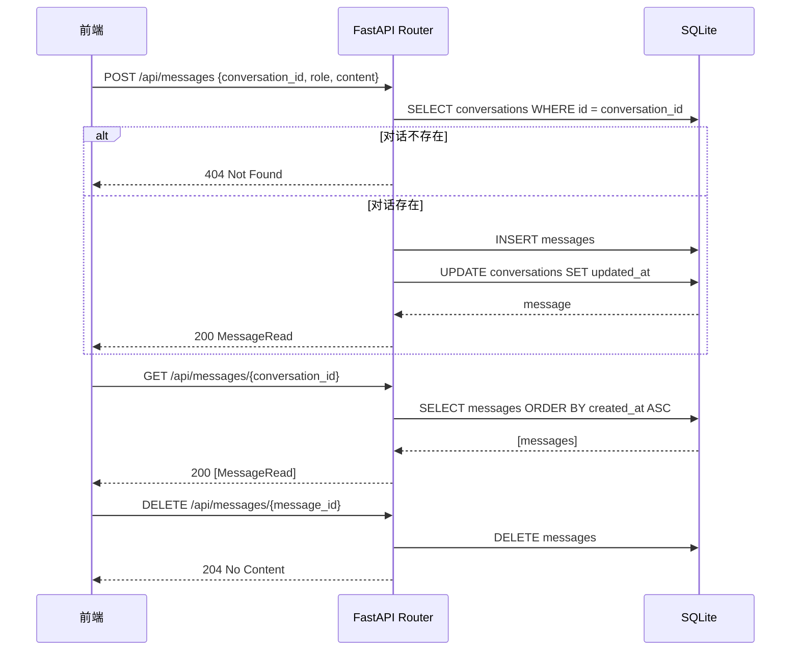

# 第四章：后端消息 API

## 目标

实现消息的创建、查询、删除 API，支持按对话查询消息历史。

## 消息数据结构

```python
class MessageCreate(BaseModel):
    conversation_id: str
    role: str = Field(pattern="^(user|assistant)$")
    content: str = Field(min_length=1)

class MessageRead(BaseModel):
    model_config = ConfigDict(from_attributes=True)
    
    id: str
    conversation_id: str
    role: str
    content: str
    status: str
    created_at: datetime
```

设计决策：
- **role 用正则验证**：只允许 `"user"` 或 `"assistant"`，FastAPI 自动返回 422 错误
- **content 不能为空**：`min_length=1` 防止空消息
- **status 由后端控制**：客户端不能传 status，默认 `"complete"`

## API 端点

### POST /api/messages - 创建消息

```python
@router.post("/", response_model=MessageRead)
async def create_message(data: MessageCreate, session: AsyncSession = Depends(get_session)):
    # Verify conversation exists
    conversation = await session.get(Conversation, data.conversation_id)
    if not conversation:
        raise HTTPException(status_code=404, detail="Conversation not found")
    
    message = Message(
        conversation_id=data.conversation_id,
        role=data.role,
        content=data.content,
    )
    session.add(message)
    
    # Update conversation's updated_at
    conversation.updated_at = datetime.utcnow()
    session.add(conversation)
    
    await session.commit()
    await session.refresh(message)
    return message
```

关键点：
1. **验证对话存在**：防止消息写入不存在的对话
2. **更新对话时间**：每次新消息都更新 `conversation.updated_at`，用于对话列表排序
3. **不存附件**：附件是临时的，消息只存文本内容

### GET /api/messages/{conversation_id} - 查询消息

```python
@router.get("/{conversation_id}", response_model=list[MessageRead])
async def list_messages(conversation_id: str, session: AsyncSession = Depends(get_session)):
    conversation = await session.get(Conversation, conversation_id)
    if not conversation:
        raise HTTPException(status_code=404, detail="Conversation not found")
    
    result = await session.execute(
        select(Message)
        .where(Message.conversation_id == conversation_id)
        .order_by(col(Message.created_at).asc())
    )
    return result.scalars().all()
```

按 `created_at ASC` 排序——时间最早的在前，符合聊天记录的阅读顺序。

### DELETE /api/messages/{message_id} - 删除消息

```python
@router.delete("/{message_id}", status_code=204)
async def delete_message(message_id: str, session: AsyncSession = Depends(get_session)):
    message = await session.get(Message, message_id)
    if not message:
        raise HTTPException(status_code=404, detail="Message not found")
    
    await session.delete(message)
    await session.commit()
```

返回 `204 No Content`。

**注意**：这个端点只删除单条消息。如果需要"删除用户消息时连带删除 AI 回复"的逻辑，应该在前端实现：
1. 前端找到要删除的用户消息的 id
2. 前端找到紧随其后的 assistant 消息的 id
3. 前端依次调用 DELETE 删除两条消息

或者在后续的 chat/stream 端点中实现级联删除逻辑。

## 时序图



## 测试覆盖

```python
@pytest.mark.asyncio
async def test_create_message(client):
    conv_response = await client.post("/api/conversations/", json={"title": "测试"})
    conv_id = conv_response.json()["id"]
    
    response = await client.post(
        "/api/messages/",
        json={
            "conversation_id": conv_id,
            "role": "user",
            "content": "Hello",
        },
    )
    assert response.status_code == 200
    data = response.json()
    assert data["role"] == "user"
    assert data["content"] == "Hello"
```

测试场景：
- ✅ 创建消息（正常流程）
- ✅ 创建消息到不存在的对话（404）
- ✅ 创建消息用非法 role（422 验证错误）
- ✅ 查询对话消息列表
- ✅ 查询空对话消息列表
- ✅ 删除消息
- ✅ 删除不存在的消息（404）

运行测试：

```bash
cd backend
pytest tests/test_message.py -v
```

## 本章新增文件

```
backend/
├── schemas/
│   └── message.py          # MessageCreate/Read
├── routers/
│   └── message.py          # 消息 CRUD routes
└── tests/
    └── test_message.py     # 7 个测试用例
```
