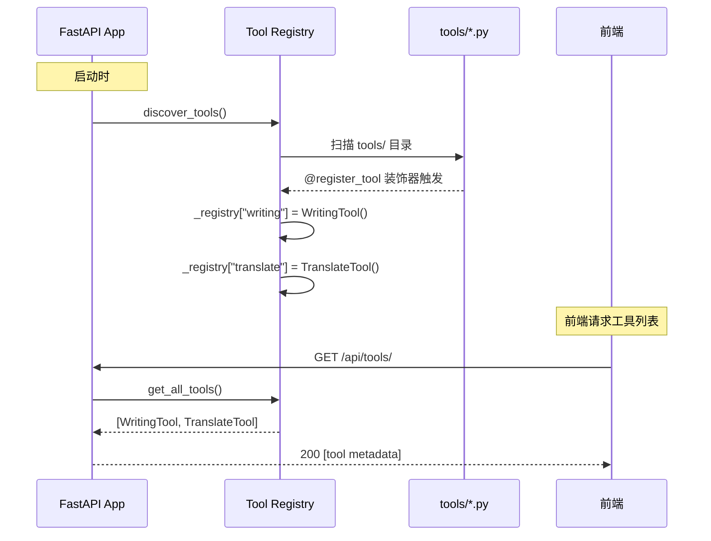

# 第五章：后端工具插件体系

## 目标

实现插件式的工具注册系统，支持动态发现和注册工具，为 AI 写作和翻译两个内置工具建立基础架构。

## 为什么需要工具插件体系？

在我们的 Agent Demo 中，"工具"是指**输入框里可切换的能力**：
- **AI 写作**：润色、改写、扩展文本
- **翻译**：多语言翻译
- **未来可扩展**：摘要、代码解释、数据分析等

每个工具本质上是一段 **system prompt + 参数模板**，发送给 LLM 时拼装成完整的 prompt。

## 工具架构设计

### 核心概念

```
前端 ToolPlugin                后端 ToolHandler
─────────────                  ─────────────────
id: string                     name: str
name: string                   description: str
icon: ReactNode                system_prompt: str
inputTemplate?:                parameters: list[ToolParameter]
  React.Component              
defaultParams?:                async handle(messages, params)
  Record<string, any>            -> AsyncIterator[str]
```

**关键设计决策**：
- 前后端工具通过 `id/name` 一一对应
- 前端负责 UI（图标、输入组件），后端负责逻辑（prompt、调用 LLM）
- 工具注册使用**声明式**：新增工具只需创建一个文件，不需要改任何已有代码

### 工具参数

```python
class ToolParameter(BaseModel):
    name: str           # 参数名，如 "style", "target_lang"
    type: str           # "string" | "number" | "boolean" | "array"
    description: str    # 参数说明
    required: bool      # 是否必填
    default: Any        # 默认值
    enum: list[str]     # 可选值列表
```

参数由后端定义，前端根据参数生成对应的 UI 组件（下拉框、输入框等）。

## 工具基类

```python
# tools/base.py
class ToolHandler(ABC):
    """Abstract base class for tool handlers."""
    
    name: str
    description: str
    system_prompt: str
    parameters: list[ToolParameter] = []
    
    @abstractmethod
    async def handle(
        self,
        messages: list[dict[str, str]],
        params: dict[str, Any] | None = None,
    ) -> AsyncIterator[str]:
        """Handle the tool invocation and yield response chunks."""
        pass
    
    def to_dict(self) -> dict[str, Any]:
        """Convert tool metadata to dict for API response."""
        return {
            "id": self.name,
            "name": self.name,
            "description": self.description,
            "parameters": [p.model_dump() for p in self.parameters],
        }
```

关键点：
- `handle()` 是抽象方法，每个工具必须实现
- 返回 `AsyncIterator[str]`，支持 SSE 流式输出
- `to_dict()` 将工具元数据序列化为 JSON，供前端使用

## 工具注册中心

```python
# tools/registry.py
_registry: dict[str, ToolHandler] = {}

def register_tool(tool_class: Type[ToolHandler]) -> Type[ToolHandler]:
    """Decorator to register a tool handler."""
    instance = tool_class()
    _registry[instance.name] = instance
    return tool_class

def discover_tools() -> None:
    """Auto-discover and register tools from the tools directory."""
    tools_dir = Path(__file__).parent
    
    for file in tools_dir.glob("*.py"):
        if file.name in ("__init__.py", "base.py", "registry.py"):
            continue
        
        module_name = f"tools.{file.stem}"
        module = importlib.import_module(module_name)
        
        # Find all ToolHandler subclasses
        for _, obj in inspect.getmembers(module, inspect.isclass):
            if issubclass(obj, ToolHandler) and obj is not ToolHandler:
                if obj.name not in _registry:
                    instance = obj()
                    _registry[instance.name] = instance
```

**自动发现机制**：
1. 扫描 `tools/` 目录下所有 `.py` 文件
2. 导入每个模块，触发 `@register_tool` 装饰器
3. 找到所有 `ToolHandler` 子类，实例化并注册

**好处**：
- 新增工具只需在 `tools/` 目录创建一个文件
- 不需要修改 `registry.py` 或任何其他文件
- 工具自动出现在 `GET /api/tools` 响应中

## 实现 AI 写作工具

```python
# tools/writing.py
@register_tool
class WritingTool(ToolHandler):
    name = "writing"
    description = "AI写作助手 - 帮助润色、改写、扩展文本"
    system_prompt = """你是一个专业的AI写作助手。你的任务是帮助用户：
- 润色和改写文本，使其更加流畅和专业
- 扩展简短的想法，提供更详细的内容
- 调整文本的语气和风格（正式/非正式、学术/通俗等）
- 修正语法和拼写错误

请根据用户的要求，提供高质量的中文写作建议。"""
    
    parameters = [
        ToolParameter(
            name="style",
            type="string",
            description="写作风格",
            required=False,
            default="formal",
            enum=["formal", "casual", "academic", "creative"],
        ),
    ]
    
    async def handle(self, messages, params=None):
        style = (params or {}).get("style", "formal")
        style_map = {
            "formal": "正式、专业",
            "casual": "轻松、口语化",
            "academic": "学术、严谨",
            "creative": "创意、生动",
        }
        style_desc = style_map.get(style, "正式、专业")
        
        enhanced_prompt = f"{self.system_prompt}\n\n当前要求的写作风格：{style_desc}"
        
        async for chunk in stream_chat(messages=messages, system_prompt=enhanced_prompt):
            yield chunk
```

## 实现翻译工具

```python
# tools/translate.py
@register_tool
class TranslateTool(ToolHandler):
    name = "translate"
    description = "翻译工具 - 支持多语言翻译"
    system_prompt = """你是一个专业的翻译助手。你的任务是将用户提供的文本准确、流畅地翻译成目标语言。

翻译原则：
- 保持原文的语气和风格
- 使用目标语言的自然表达方式
- 对于专业术语，提供准确的翻译
- 如果原文有歧义，在翻译后添加简短的说明

请只输出翻译结果，不要添加额外的解释。"""
    
    parameters = [
        ToolParameter(
            name="target_lang",
            type="string",
            description="目标语言",
            required=True,
            default="en",
            enum=["en", "zh", "ja", "ko", "fr", "de", "es"],
        ),
    ]
    
    async def handle(self, messages, params=None):
        target_lang = (params or {}).get("target_lang", "en")
        lang_map = {
            "en": "英语", "zh": "中文", "ja": "日语",
            "ko": "韩语", "fr": "法语", "de": "德语", "es": "西班牙语",
        }
        lang_name = lang_map.get(target_lang, "英语")
        
        enhanced_prompt = f"{self.system_prompt}\n\n目标语言：{lang_name}"
        
        async for chunk in stream_chat(messages=messages, system_prompt=enhanced_prompt):
            yield chunk
```

## LLM 服务层

```python
# services/llm_service.py
async def stream_chat(
    messages: list[dict[str, str]],
    system_prompt: str | None = None,
) -> AsyncIterator[str]:
    """Stream chat responses from DashScope API."""
    full_messages = []
    if system_prompt:
        full_messages.append({"role": "system", "content": system_prompt})
    full_messages.extend(messages)
    
    responses = Generation.call(
        api_key=settings.aliyun_dashscope_api_key,
        model=settings.text_model,
        messages=full_messages,
        result_format="message",
        stream=True,
        incremental_output=True,
    )
    
    for response in responses:
        if response.status_code == 200:
            content = response.output.choices[0].message.content
            if content:
                yield content
        else:
            yield f"[API Error: {response.code}]"
            break
```

关键知识点：
- `Generation.call()` 是 DashScope SDK 的同步 API
- `stream=True` 启用流式输出
- `incremental_output=True` 每次只返回新增内容（不是完整响应）
- 虽然我们写的是 `async def`，但底层 DashScope SDK 是同步的。在生产环境中应该用线程池包装

## API 端点

```python
# routers/tools.py
@router.get("/api/tools/")
async def list_tools():
    """List all available tools."""
    tools = get_all_tools()
    return [tool.to_dict() for tool in tools]
```

响应示例：
```json
[
  {
    "id": "writing",
    "name": "writing",
    "description": "AI写作助手 - 帮助润色、改写、扩展文本",
    "parameters": [
      {
        "name": "style",
        "type": "string",
        "description": "写作风格",
        "required": false,
        "default": "formal",
        "enum": ["formal", "casual", "academic", "creative"]
      }
    ]
  },
  {
    "id": "translate",
    "name": "translate",
    "description": "翻译工具 - 支持多语言翻译",
    "parameters": [
      {
        "name": "target_lang",
        "type": "string",
        "description": "目标语言",
        "required": true,
        "default": "en",
        "enum": ["en", "zh", "ja", "ko", "fr", "de", "es"]
      }
    ]
  }
]
```

## 时序图



## 测试覆盖

```python
@pytest.mark.asyncio
async def test_discover_tools():
    discover_tools()
    tools = get_all_tools()
    assert len(tools) >= 2
    tool_names = [t.name for t in tools]
    assert "writing" in tool_names
    assert "translate" in tool_names

@pytest.mark.asyncio
async def test_tools_list_endpoint(client):
    response = await client.get("/api/tools/")
    assert response.status_code == 200
    data = response.json()
    assert len(data) >= 2
```

运行测试：

```bash
cd backend
pytest tests/test_tools.py -v
```

## 如何新增一个工具？

假设你要新增一个"摘要"工具：

1. 创建 `tools/summary.py`：

```python
from tools.base import ToolHandler
from tools.registry import register_tool

@register_tool
class SummaryTool(ToolHandler):
    name = "summary"
    description = "文本摘要工具"
    system_prompt = "你是一个专业的文本摘要助手..."
    parameters = []
    
    async def handle(self, messages, params=None):
        async for chunk in stream_chat(messages, self.system_prompt):
            yield chunk
```

2. 重启后端服务
3. `GET /api/tools` 自动返回新工具

**不需要改任何已有代码**——这就是插件体系的价值。

## 本章新增文件

```
backend/
├── tools/
│   ├── __init__.py
│   ├── base.py            # ToolHandler 抽象基类
│   ├── registry.py        # 工具注册中心
│   ├── writing.py         # AI 写作工具
│   └── translate.py       # 翻译工具
├── services/
│   ├── __init__.py
│   └── llm_service.py     # DashScope LLM 调用封装
├── routers/
│   └── tools.py           # GET /api/tools 端点
└── tests/
    └── test_tools.py      # 7 个测试用例
```
