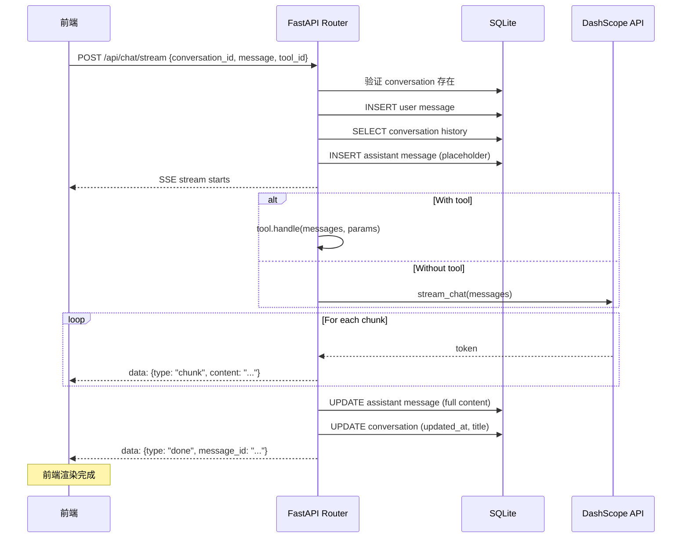

# 第六章：后端 SSE 流式聊天

## 目标

实现 SSE (Server-Sent Events) 流式聊天端点，支持工具调用、自动标题生成、消息持久化。

## SSE vs WebSocket vs REST

| 方案 | 优点 | 缺点 | 适用场景 |
|------|------|------|---------|
| **REST** | 简单、无状态 | 不能流式输出 | CRUD 操作 |
| **WebSocket** | 全双工、实时 | 复杂、需要连接管理 | 多人协作、游戏 |
| **SSE** | 单向流、HTTP 原生 | 只能服务端→客户端 | **AI 流式对话** ✅ |

我们选择 SSE，因为：
1. LLM 响应是单向流（服务端→客户端）
2. 基于 HTTP，不需要额外的连接管理
3. 浏览器原生支持 `EventSource` API
4. FastAPI 的 `StreamingResponse` 天然支持

## SSE 协议格式

```
data: {"type": "chunk", "content": "你"}

data: {"type": "chunk", "content": "好"}

data: {"type": "chunk", "content": "！"}

data: {"type": "title", "title": "问候对话"}

data: {"type": "done", "message_id": "uuid-xxx"}
```

事件类型：
- `chunk`：文本片段，前端追加到当前消息
- `title`：自动生成的对话标题（仅第一条消息）
- `done`：流式完成，包含 assistant 消息 ID
- `error`：错误信息

## 流式聊天实现

### 请求体

```python
class ChatRequest(BaseModel):
    conversation_id: str
    message: str
    tool_id: str | None = None
    tool_params: dict | None = None
```

### 核心流程

```python
@router.post("/stream")
async def stream_chat(request: ChatRequest, session: AsyncSession = Depends(get_session)):
    # 1. 验证对话存在
    conversation = await session.get(Conversation, request.conversation_id)
    if not conversation:
        raise HTTPException(status_code=404, detail="Conversation not found")
    
    # 2. 保存用户消息
    user_msg = Message(
        conversation_id=request.conversation_id,
        role="user",
        content=request.message,
    )
    session.add(user_msg)
    await session.commit()
    
    # 3. 加载对话历史
    history = await load_messages(request.conversation_id)
    messages = [{"role": msg.role, "content": msg.content} for msg in history]
    
    # 4. 创建 assistant 消息占位符
    assistant_msg = Message(
        conversation_id=request.conversation_id,
        role="assistant",
        content="",
        status=MessageStatus.COMPLETE,
    )
    session.add(assistant_msg)
    await session.commit()
    
    # 5. 流式生成响应
    async def event_generator():
        full_content = ""
        
        try:
            if request.tool_id:
                tool = get_tool(request.tool_id)
                async for chunk in tool.handle(messages, request.tool_params):
                    full_content += chunk
                    yield f"data: {json.dumps({'type': 'chunk', 'content': chunk})}\n\n"
            else:
                async for chunk in stream_chat(messages, system_prompt):
                    full_content += chunk
                    yield f"data: {json.dumps({'type': 'chunk', 'content': chunk})}\n\n"
            
            # 6. 更新 assistant 消息
            assistant_msg.content = full_content
            session.add(assistant_msg)
            
            # 7. 自动标题（第一条消息）
            if len(history) <= 1:
                new_title = request.message[:30] + "..."
                conversation.title = new_title
                yield f"data: {json.dumps({'type': 'title', 'title': new_title})}\n\n"
            
            await session.commit()
            yield f"data: {json.dumps({'type': 'done', 'message_id': assistant_msg.id})}\n\n"
        
        except Exception as e:
            assistant_msg.status = MessageStatus.INTERRUPTED
            session.add(assistant_msg)
            await session.commit()
            yield f"data: {json.dumps({'type': 'error', 'message': str(e)})}\n\n"
    
    return StreamingResponse(
        event_generator(),
        media_type="text/event-stream",
        headers={
            "Cache-Control": "no-cache",
            "Connection": "keep-alive",
        },
    )
```

## 时序图



## 自动标题生成

```python
# 仅第一条消息时生成标题
if len(history) <= 1:
    new_title = request.message[:30] + ("..." if len(request.message) > 30 else "")
    conversation.title = new_title
    session.add(conversation)
    yield f"data: {json.dumps({'type': 'title', 'title': new_title})}\n\n"
```

逻辑：
- 取用户第一条消息的前 30 个字符
- 如果超过 30 字符，加 `...` 后缀
- 发送 `title` 事件通知前端更新侧栏

## 错误处理

```python
except Exception as e:
    # 标记消息为 INTERRUPTED
    assistant_msg.content = full_content
    assistant_msg.status = MessageStatus.INTERRUPTED
    session.add(assistant_msg)
    await session.commit()
    
    yield f"data: {json.dumps({'type': 'error', 'message': str(e)})}\n\n"
```

即使流式中断，也会：
1. 保存已生成的部分内容
2. 标记消息状态为 `INTERRUPTED`
3. 发送 `error` 事件通知前端

## 测试策略

使用 `unittest.mock` 模拟 DashScope API：

```python
@pytest.mark.asyncio
async def test_stream_chat_basic(client):
    conv_response = await client.post("/api/conversations/", json={"title": "测试"})
    conv_id = conv_response.json()["id"]
    
    # Mock DashScope API
    mock_response = AsyncMock()
    mock_response.status_code = 200
    mock_response.output.choices = [
        AsyncMock(message=AsyncMock(content="Hello!"))
    ]
    
    with patch("services.llm_service.Generation") as mock_gen:
        mock_gen.call.return_value = [mock_response]
        
        response = await client.post(
            "/api/chat/stream",
            json={
                "conversation_id": conv_id,
                "message": "Hi",
            },
        )
        
        assert response.status_code == 200
        content = await response.aread()
        text = content.decode()
        assert "chunk" in text
        assert "done" in text
```

测试场景：
- ✅ 基础流式聊天（无工具）
- ✅ 带工具的流式聊天
- ✅ 无效对话 ID（404）
- ✅ 自动标题生成
- ✅ 消息持久化验证

运行测试：

```bash
cd backend
pytest tests/test_chat.py -v
```

## StreamingResponse 关键配置

```python
return StreamingResponse(
    event_generator(),
    media_type="text/event-stream",
    headers={
        "Cache-Control": "no-cache",      # 禁用缓存
        "Connection": "keep-alive",        # 保持连接
    },
)
```

- `media_type="text/event-stream"`：告诉浏览器这是 SSE 流
- `Cache-Control: no-cache`：防止代理缓存
- `Connection: keep-alive`：保持长连接

## 前端如何消费？

```typescript
// useSSE.ts hook（下一章实现）
const response = await fetch('/api/chat/stream', {
  method: 'POST',
  headers: { 'Content-Type': 'application/json' },
  body: JSON.stringify(request),
})

const reader = response.body!.getReader()
const decoder = new TextDecoder()

while (true) {
  const { done, value } = await reader.read()
  if (done) break
  
  const text = decoder.decode(value)
  // 解析 SSE: "data: {...}\n\n"
  for (const line of text.split('\n\n')) {
    if (line.startsWith('data: ')) {
      const event = JSON.parse(line.slice(6))
      switch (event.type) {
        case 'chunk': appendToken(event.content); break
        case 'title': updateTitle(event.title); break
        case 'done': finishMessage(event.message_id); break
        case 'error': showError(event.message); break
      }
    }
  }
}
```

## 本章新增文件

```
backend/
├── schemas/
│   └── chat.py            # ChatRequest schema
├── routers/
│   └── chat.py            # POST /api/chat/stream (SSE)
└── tests/
    └── test_chat.py       # 5 个测试用例
```

## 下一章：前端 SSE 消费

后端 SSE 流已经就绪，下一章实现前端的 `useSSE` hook 来消费流式响应。
