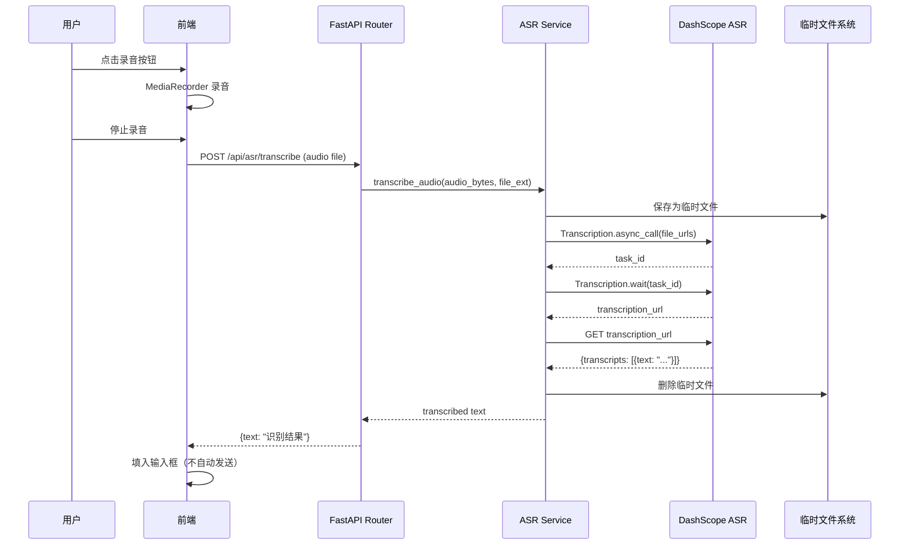

# 第七章：后端 ASR 语音识别

## 目标

实现语音识别服务，支持前端上传音频文件并转换为文本，为语音输入功能提供后端支持。

## 语音输入流程



## 为什么需要 ASR 服务？

前端通过 `MediaRecorder` API 录制的音频是 WebM 格式，需要转换为文本。DashScope ASR API 支持多种音频格式（WebM、MP3、WAV 等），但需要：
1. 将音频保存为临时文件
2. 提交异步转录任务
3. 等待转录完成并获取结果
4. 清理临时文件

## ASR 服务实现

### 核心函数

```python
# services/asr_service.py
async def transcribe_audio(audio_bytes: bytes, file_ext: str = "webm") -> str:
    """Transcribe audio bytes to text using DashScope ASR API."""
    
    # 1. 保存为临时文件
    with tempfile.NamedTemporaryFile(
        mode="wb",
        suffix=f".{file_ext}",
        delete=False,
    ) as tmp_file:
        tmp_file.write(audio_bytes)
        tmp_path = tmp_file.name
    
    try:
        # 2. 提交异步转录任务
        task_response = Transcription.async_call(
            model=settings.asr_model,
            api_key=settings.aliyun_dashscope_api_key,
            file_urls=[f"file://{tmp_path}"],
            language_hints=["zh", "en"],
        )
        
        # 3. 等待转录完成
        transcription_response = Transcription.wait(task_response.output.task_id)
        
        # 4. 获取转录结果
        if transcription_response.status_code == 200:
            results = transcription_response.output.get("results")
            if results:
                first_result = results[0]
                transcript_url = first_result.get("transcription_url")
                
                if transcript_url:
                    async with httpx.AsyncClient() as client:
                        resp = await client.get(transcript_url)
                        if resp.status_code == 200:
                            data = resp.json()
                            transcripts = data.get("transcripts", [])
                            if transcripts:
                                return transcripts[0].get("text", "")
        
        return "[Transcription failed: no results]"
    
    finally:
        # 5. 清理临时文件
        Path(tmp_path).unlink(missing_ok=True)
```

### 关键点

1. **临时文件**：DashScope ASR API 需要文件 URL，不能直接传 bytes，所以先保存到临时文件
2. **异步任务**：ASR 是异步的，先提交任务拿到 `task_id`，再轮询等待结果
3. **多语言**：`language_hints=["zh", "en"]` 支持中英文混合识别
4. **清理**：`finally` 块确保临时文件被删除，即使出错也不会泄漏

## API 端点

```python
# routers/asr.py
@router.post("/transcribe")
async def transcribe(audio: UploadFile = File(...)):
    """Transcribe audio file to text."""
    
    # 读取音频字节
    audio_bytes = await audio.read()
    
    # 提取文件扩展名
    file_ext = "webm"  # 默认
    if audio.filename:
        ext = audio.filename.rsplit(".", 1)[-1].lower()
        if ext in ("webm", "mp3", "wav", "m4a", "ogg"):
            file_ext = ext
    
    # 转录
    text = await transcribe_audio(audio_bytes, file_ext)
    
    return {"text": text, "filename": audio.filename}
```

### 支持的音频格式

| 格式 | 扩展名 | 说明 |
|------|--------|------|
| WebM | .webm | 浏览器 MediaRecorder 默认格式 |
| MP3 | .mp3 | 常见音频格式 |
| WAV | .wav | 无损音频 |
| M4A | .m4a | Apple 音频格式 |
| OGG | .ogg | 开源音频格式 |

## 请求/响应示例

### 请求

```bash
curl -X POST http://localhost:8000/api/asr/transcribe \
  -F "audio=@recording.webm;type=audio/webm"
```

### 响应

```json
{
  "text": "你好，今天天气怎么样？",
  "filename": "recording.webm"
}
```

## 错误处理

ASR 服务可能遇到的错误：

| 错误 | 原因 | 处理方式 |
|------|------|---------|
| API quota exceeded | 配额用尽 | 返回错误提示，前端显示 |
| Invalid audio format | 不支持的格式 | 返回错误提示 |
| Transcription failed | 识别失败 | 返回 `[Transcription failed]` |
| Network error | 网络问题 | 返回错误信息 |

```python
# 错误时返回可读的错误信息
return "[ASR Error: API quota exceeded]"
```

前端收到错误信息后，可以显示 toast 提示用户。

## 测试策略

使用 `unittest.mock` 模拟 ASR 服务：

```python
@pytest.mark.asyncio
async def test_transcribe_audio_success(client):
    """Test successful audio transcription."""
    with patch("routers.asr.transcribe_audio", new_callable=AsyncMock) as mock_transcribe:
        mock_transcribe.return_value = "你好世界"
        
        response = await client.post(
            "/api/asr/transcribe",
            files={"audio": ("test.webm", b"fake audio", "audio/webm")},
        )
        
        assert response.status_code == 200
        data = response.json()
        assert data["text"] == "你好世界"
```

测试场景：
- ✅ 成功转录
- ✅ 空音频
- ✅ ASR 错误
- ✅ 不同音频格式（webm, mp3, wav, m4a）

运行测试：

```bash
cd backend
pytest tests/test_asr.py -v
```

## 前端集成（下一章）

前端使用 `MediaRecorder` API 录音：

```typescript
// useVoiceInput.ts hook
const mediaRecorder = new MediaRecorder(stream)
const chunks: Blob[] = []

mediaRecorder.ondataavailable = (e) => {
  chunks.push(e.data)
}

mediaRecorder.onstop = async () => {
  const audioBlob = new Blob(chunks, { type: 'audio/webm' })
  
  const formData = new FormData()
  formData.append('audio', audioBlob, 'recording.webm')
  
  const response = await fetch('/api/asr/transcribe', {
    method: 'POST',
    body: formData,
  })
  
  const { text } = await response.json()
  
  // 填入输入框（不自动发送）
  setInputText(text)
}
```

## 本章新增文件

```
backend/
├── services/
│   └── asr_service.py     # DashScope ASR 封装
├── routers/
│   └── asr.py             # POST /api/asr/transcribe
└── tests/
    └── test_asr.py        # 4 个测试用例
```

## 下一章：前端布局

后端 API 已全部完成（对话、消息、工具、聊天、ASR），下一章开始前端开发。
