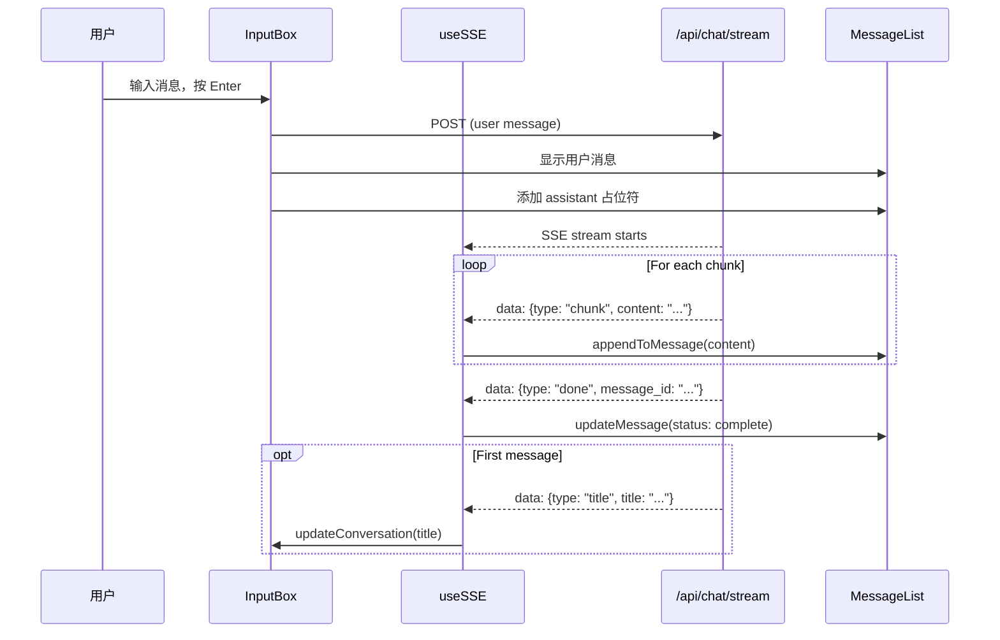

# 第十章：前端聊天界面

## 目标

实现完整的聊天功能，包括 SSE 流式响应、Markdown 渲染、虚拟滚动。

## SSE 流式消费

### useSSE Hook

```typescript
export function useSSE(
  onChunk: (conversationId: string, messageId: string, content: string) => void,
  onDone: (conversationId: string, messageId: string) => void,
  onTitle: (conversationId: string, title: string) => void,
  onError: (error: string) => void
): UseSSEResult {
  const [isStreaming, setIsStreaming] = useState(false);
  const [error, setError] = useState<string | null>(null);

  const sendMessage = useCallback(
    async (conversationId, message, toolId?, toolParams?) => {
      setIsStreaming(true);
      setError(null);

      try {
        const response = await fetch('/api/chat/stream', {
          method: 'POST',
          headers: { 'Content-Type': 'application/json' },
          body: JSON.stringify({
            conversation_id: conversationId,
            message,
            tool_id: toolId,
            tool_params: toolParams,
          }),
        });

        const reader = response.body!.getReader();
        const decoder = new TextDecoder();

        while (true) {
          const { done, value } = await reader.read();
          if (done) break;

          const text = decoder.decode(value);
          const lines = text.split('\n\n');

          for (const line of lines) {
            if (!line.startsWith('data: ')) continue;

            const event: SSEEvent = JSON.parse(line.slice(6));

            switch (event.type) {
              case 'chunk':
                onChunk(conversationId, messageId, event.content);
                break;
              case 'title':
                onTitle(conversationId, event.title);
                break;
              case 'done':
                onDone(conversationId, event.message_id);
                break;
              case 'error':
                onError(event.message);
                break;
            }
          }
        }
      } catch (err) {
        onError(err.message);
      } finally {
        setIsStreaming(false);
      }
    },
    [onChunk, onDone, onTitle, onError]
  );

  return { sendMessage, isStreaming, error };
}
```

### 使用方式

```typescript
const { sendMessage, isStreaming } = useSSE(
  onChunk,  // 追加文本到 assistant 消息
  onDone,   // 标记消息完成
  onTitle,  // 更新对话标题
  onError   // 显示错误提示
);
```

## 虚拟滚动

使用 `react-virtuoso` 实现高性能消息列表：

```typescript
import { Virtuoso } from 'react-virtuoso';

<Virtuoso
  ref={virtuosoRef}
  className="h-full"
  data={conversationMessages}
  followOutput="smooth"  // 新消息时自动滚动到底部
  itemContent={(index, message) => (
    <MessageBubble message={message} />
  )}
/>
```

关键特性：
- **虚拟渲染**：只渲染可视区域的消息，支持万条消息无压力
- **自动跟随**：`followOutput="smooth"` 新消息时平滑滚动到底部
- **动态高度**：自动检测消息高度变化（流式输出时内容增长）

## Markdown 渲染

使用 `react-markdown` + 插件：

```typescript
import ReactMarkdown from 'react-markdown';
import remarkGfm from 'remark-gfm';
import rehypeHighlight from 'rehype-highlight';

<ReactMarkdown
  remarkPlugins={[remarkGfm]}
  rehypePlugins={[rehypeHighlight]}
>
  {message.content}
</ReactMarkdown>
```

插件说明：
- **remark-gfm**：GitHub Flavored Markdown（表格、任务列表、删除线）
- **rehype-highlight**：代码块语法高亮

### 为什么 AI 回复用 Markdown？

LLM 输出通常是 Markdown 格式：
- 代码块：```python ... ```
- 列表：- item 1, - item 2
- 表格：| col1 | col2 |
- 链接：[text](url)

用户消息不需要 Markdown，直接显示纯文本。

## 发送消息流程

```typescript
const handleSend = async () => {
  if (!message.trim() || !activeConversationId || isStreaming) {
    return;
  }

  const userMessage = message.trim();
  setMessage('');

  try {
    // 1. 立即显示用户消息
    const userMsg = await createMessage(activeConversationId, 'user', userMessage);
    addMessage(activeConversationId, userMsg);

    // 2. 添加 assistant 消息占位符
    const assistantMsg = {
      id: `temp-${Date.now()}`,
      conversation_id: activeConversationId,
      role: 'assistant',
      content: '',
      status: 'complete',
      created_at: new Date().toISOString(),
    };
    addMessage(activeConversationId, assistantMsg);

    // 3. 开始流式响应
    await sendMessage(activeConversationId, userMessage);
  } catch (error) {
    Message.error('发送消息失败');
  }
};
```

### 时序图



## 输入框状态

```typescript
<Input.TextArea
  value={message}
  onChange={setMessage}
  placeholder={
    isStreaming ? 'AI 正在回复中...' : '输入消息... (Enter 发送)'
  }
  disabled={isStreaming}
/>
<Button
  icon={isStreaming ? <IconLoading /> : <IconSend />}
  disabled={!message.trim() || isStreaming}
  loading={isStreaming}
/>
```

流式输出期间：
- 输入框禁用，防止用户发送新消息
- 按钮显示 loading 状态
- 提示 "AI 正在回复中..."

## 本章新增/改进文件

```
frontend/src/
└── features/
    └── chat/
        ├── hooks/
        │   ├── index.ts
        │   └── useSSE.ts              # SSE 流式消费 hook
        └── components/
            ├── MessageList.tsx         # 虚拟滚动 + Markdown 渲染
            └── InputBox.tsx            # 发送消息 + 流式状态
```

## 下一章：工具切换和语音输入

实现输入框的高级功能：
- 工具选择（AI 写作、翻译）
- 语音输入
- 附件上传
