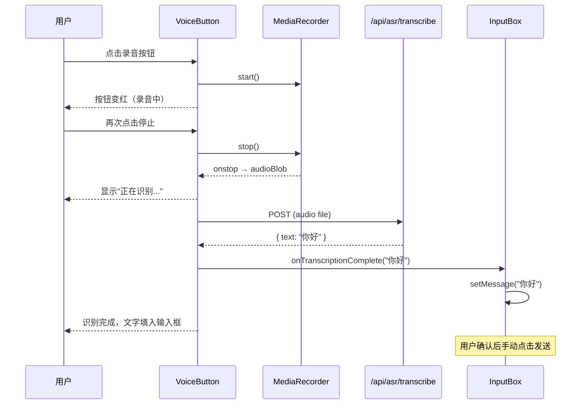

# 第十一章：前端输入框增强

## 目标

为输入框添加工具切换、语音输入、附件上传功能，实现完整的交互体验。

## 输入框布局

```
┌─────────────────────────────────────────────┐
│  [附件预览区]                                │
│  ┌─────┐ ┌─────┐ ┌─────┐                   │
│  │ 🖼️  │ │ 🎵  │ │ 📄  │                   │
│  │img1 │ │aud1 │ │doc1 │                   │
│  └─────┘ └─────┘ └─────┘                   │
├─────────────────────────────────────────────┤
│  [工具选择] [🎙️] [📎]                        │
│  AI写作      语音  附件                       │
├─────────────────────────────────────────────┤
│  ┌─────────────────────────────┐ ┌────┐    │
│  │ 输入消息...                 │ │发送│    │
│  └─────────────────────────────┘ └────┘    │
└─────────────────────────────────────────────┘
```

## 工具切换（ToolSelector）

```typescript
export default function ToolSelector({ value, onChange, disabled }: Props) {
  const [tools, setTools] = useState<Tool[]>([]);

  useEffect(() => {
    const data = await fetchTools();
    setTools(data);
  }, []);

  return (
    <Select value={value || 'default'} onChange={(val) => onChange(val)}>
      <Select.Option value="default">默认对话</Select.Option>
      {tools.map((tool) => (
        <Select.Option key={tool.id} value={tool.id}>
          {tool.name}
        </Select.Option>
      ))}
    </Select>
  );
}
```

**关键设计**：
- 启动时从 `GET /api/tools/` 获取工具列表
- 默认选项"默认对话"（不传 `tool_id`）
- 选择工具后，`tool_id` 和 `tool_params` 随消息一起发送

## 语音输入（VoiceButton）

### useVoiceInput Hook

```typescript
export function useVoiceInput(onTranscriptionComplete: (text: string) => void) {
  const [isRecording, setIsRecording] = useState(false);
  const [isTranscribing, setIsTranscribing] = useState(false);
  const mediaRecorderRef = useRef<MediaRecorder | null>(null);
  const chunksRef = useRef<Blob[]>([]);

  const startRecording = async () => {
    const stream = await navigator.mediaDevices.getUserMedia({ audio: true });
    const mediaRecorder = new MediaRecorder(stream, {
      mimeType: 'audio/webm;codecs=opus',
    });

    chunksRef.current = [];
    mediaRecorder.ondataavailable = (e) => chunksRef.current.push(e.data);

    mediaRecorder.onstop = async () => {
      const audioBlob = new Blob(chunksRef.current, { type: 'audio/webm' });
      stream.getTracks().forEach((track) => track.stop());

      setIsTranscribing(true);
      const text = await transcribeAudio(audioBlob);
      onTranscriptionComplete(text);
      setIsTranscribing(false);
    };

    mediaRecorder.start();
    setIsRecording(true);
  };

  return { isRecording, isTranscribing, startRecording, stopRecording };
}
```

### 语音输入流程



**关键决策**：
- 语音识别结果**填入输入框，不自动发送**——用户有机会修改识别错误
- 录音状态：按钮变红 + 脉动动画
- 识别中：显示 loading 状态

## 附件上传（useAttachment Hook）

```typescript
export function useAttachment() {
  const [attachments, setAttachments] = useState<Attachment[]>([]);

  const addAttachment = (file: File) => {
    const attachment: Attachment = { file };
    if (file.type.startsWith('image/')) {
      const reader = new FileReader();
      reader.onload = (e) => {
        attachment.preview = e.target?.result as string;
        setAttachments((prev) => [...prev, attachment]);
      };
      reader.readAsDataURL(file);
    } else {
      setAttachments((prev) => [...prev, attachment]);
    }
  };

  return { attachments, addAttachment, removeAttachment, clearAttachments };
}
```

### AttachmentPreview 组件

```typescript
{attachments.map((attachment, index) => (
  <div className="relative group">
    {attachment.preview ? (
      <Image src={attachment.preview} width={80} height={80} />
    ) : (
      <div className="w-20 h-20">
        <IconFile />
      </div>
    )}
    <Button
      icon={<IconClose />}
      onClick={() => removeAttachment(index)}
      className="opacity-0 group-hover:opacity-100"
    />
  </div>
))}
```

**设计决策**：
- 图片附件生成缩略图预览（`FileReader.readAsDataURL`）
- 非图片附件显示文件图标
- Hover 显示删除按钮
- 附件**不持久化到后端**——仅在前端展示，发送时附带在消息中

## 输入框整合

```typescript
export default function InputBox() {
  const [message, setMessage] = useState('');
  const [selectedTool, setSelectedTool] = useState<string | null>(null);
  const { attachments, addAttachment, removeAttachment, clearAttachments } = useAttachment();

  const handleVoiceTranscription = (text: string) => {
    setMessage((prev) => (prev ? prev + ' ' + text : text));
  };

  return (
    <div className="p-4">
      <AttachmentPreview attachments={attachments} onRemove={removeAttachment} />
      
      <div className="flex items-end gap-2 mb-2">
        <ToolSelector value={selectedTool} onChange={setSelectedTool} />
        <VoiceButton onTranscriptionComplete={handleVoiceTranscription} />
        <Upload autoUpload={false} showUploadList={false} onChange={handleUpload}>
          <Button icon={<IconAttachment />} />
        </Upload>
      </div>

      <div className="flex gap-2">
        <Input.TextArea
          value={message}
          onChange={setMessage}
          onKeyDown={handleKeyDown}
          placeholder={isStreaming ? 'AI 正在回复中...' : '输入消息...'}
        />
        <Button icon={<IconSend />} onClick={handleSend} />
      </div>
    </div>
  );
}
```

## 本章新增文件

```
frontend/src/
├── api/
│   ├── tools.ts                          # GET /api/tools/
│   └── asr.ts                            # POST /api/asr/transcribe
└── features/
    └── chat/
        ├── hooks/
        │   ├── useVoiceInput.ts          # 录音 + 转录 hook
        │   └── useAttachment.ts          # 附件管理 hook
        └── components/
            ├── ToolSelector.tsx          # 工具选择下拉
            ├── VoiceButton.tsx           # 语音输入按钮
            ├── AttachmentPreview.tsx     # 附件预览区
            └── InputBox.tsx              # 整合所有功能
```

## 下一章：测试与部署

- 前端单元测试（Vitest + Testing Library）
- 前后端联调
- 部署配置
